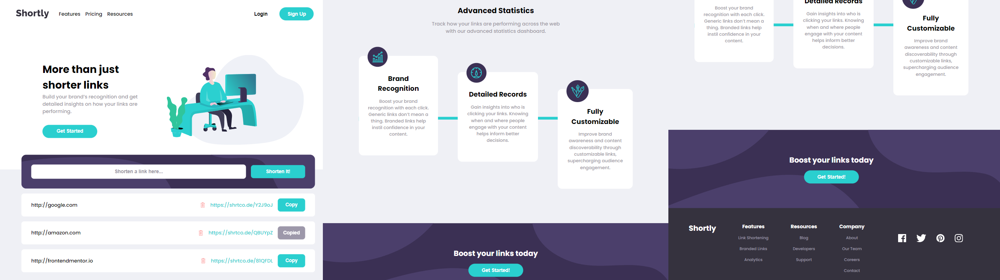
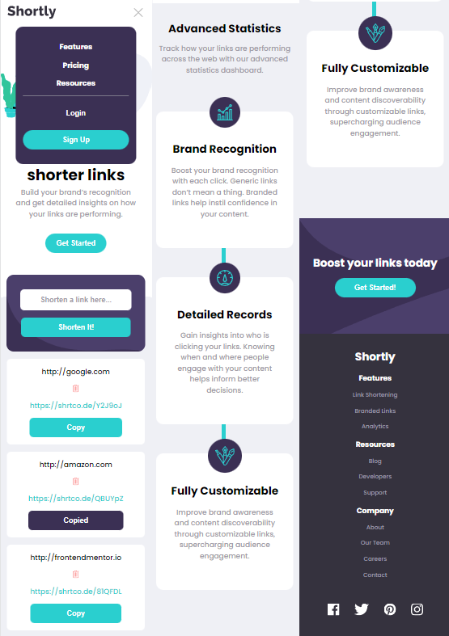

# Frontend Mentor - Shortly URL shortening API Challenge solution

This is a solution to the [Shortly URL shortening API Challenge challenge on Frontend Mentor](https://www.frontendmentor.io/challenges/url-shortening-api-landing-page-2ce3ob-G). Frontend Mentor challenges help you improve your coding skills by building realistic projects.

## Table of contents

- [Overview](#overview)
  - [The challenge](#the-challenge)
  - [Screenshot](#screenshot)
  - [Links](#links)
- [My process](#my-process)
  - [Built with](#built-with)
  - [What I learned](#what-i-learned)
- [Author](#author)

## Overview

### The challenge

Users should be able to:

- View the optimal layout for the site depending on their device's screen size
- Shorten any valid URL
- See a list of their shortened links, even after refreshing the browser
- Copy the shortened link to their clipboard in a single click
- Receive an error message when the `form` is submitted if:
  - The `input` field is empty

### Screenshot

### Links

- Solution URL: [Github](https://github.com/Helbindi/url-shortening-api)
- Live Site URL: [Vercel](helbindi-url-shortening-api.vercel.app)

## My process

### Built with

- Semantic HTML5 markup
- CSS custom properties
- Flexbox
- CSS Grid
- Mobile-first workflow
- [React](https://reactjs.org/) - JS library

### What I learned

The main goal for this project was getting used to working with an external API using fetch API and https://shrtco.de/docs

- Learned to use the useRef hook in this project for locking onto the input[text] for url shortening when user clicks on one of the two call to action buttons at the top and bottom on the webpage.
- Overall practice using CSS and styling with a mobile first approach containing: navigation, hero section, main content, about seciton, and a footer.

## Author

- Website - [My Projects Site](https://my-projects-site.vercel.app)
- Frontend Mentor - [@Helbindi](https://www.frontendmentor.io/profile/Helbindi)
